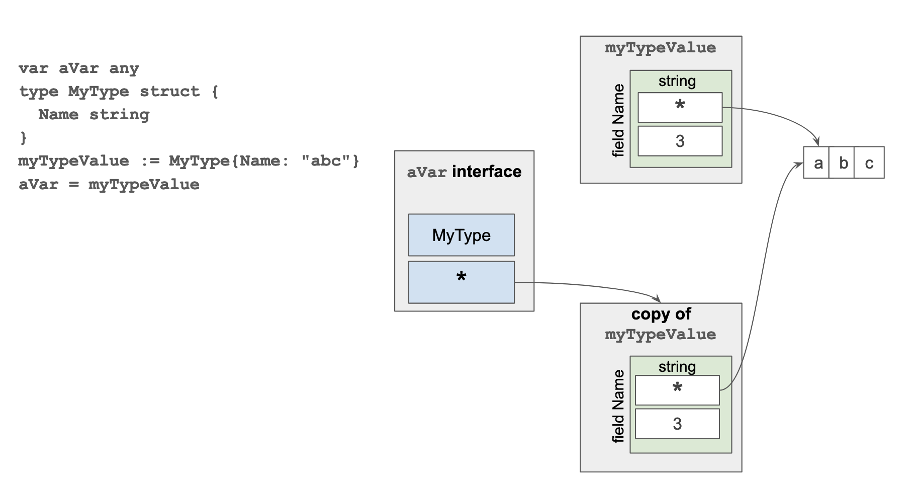

# A didactic example to prove that interface values hold copies of the concrete values they have been assigned to

For didactic purposes only.

The idea is to prove that this representation is right by comparing the addresses of the various values involved.

It uses the unsafe package. Again, for didactic purposes only.

In this program we create a value of type MyType and store it in the variable myTypeValue. The value has a field, Name, which is of type string.

We define also a variable aVar of type interface{} and we assign the value stored in myTypeValue to aVar.

The assignement operation creates a copy of the value of type MyType and it is the copy that is wrapped with the interface{} value.

To prove that it is a copy, we compare the addresses of the fields Name extracted from the value of MyType and the interface{} value and we see that they are different.

The 2 different string values share the same backing byte array, and we prove this comparing their addresses.

We then assign a new string value to the field Name of the value of type MyType stored in the variable myTypeValue.

After this new assignement, the 2 string values of the fields Name have different backing byte arrays.

To be able to handle the addresses within the interface{} value and withing the string values we use the unsafe package.

Again this example is only for didactical purposes.

Inspired by https://stackoverflow.com/a/57698257/5699993
